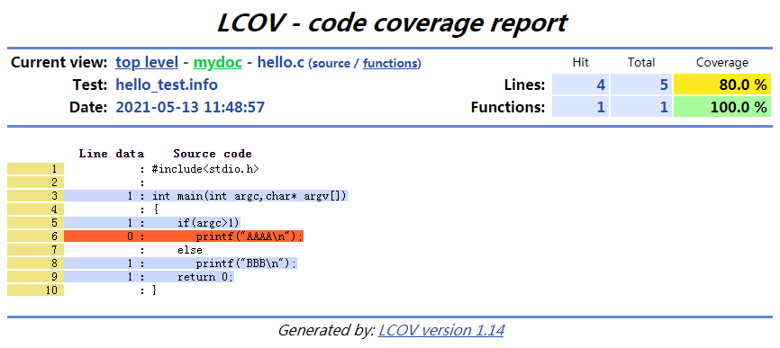

install gtest

    sudo apt  install cmake
    git clone https://github.com/google/googletest
    cd googletest
    cmake CMakeLists.txt
    make
    sudo cp ./lib/libgtest*.a  /usr/lib
    sudo cp -r googletest/include/gtest /usr/include

gtest demo

    vi test.cc

        #include<gtest/gtest.h>
        int add(int a,int b){
            return a+b;
        }
        TEST(testCase,test0){
            EXPECT_EQ(add(2,3),5);
        }
        int main(int argc,char **argv){
          testing::InitGoogleTest(&argc,argv);
          return RUN_ALL_TESTS();
        }
    g++ test.cc -lgtest -lpthread
    ./a.out
        [==========] Running 1 test from 1 test suite.
        [----------] Global test environment set-up.
        [----------] 1 test from testCase
        [ RUN      ] testCase.test0
        [       OK ] testCase.test0 (3 ms)
        [----------] 1 test from testCase (3 ms total)

        [----------] Global test environment tear-down
        [==========] 1 test from 1 test suite ran. (3 ms total)
        [  PASSED  ] 1 test.

ctags install and use

	sudo apt  install exuberant-ctags
	ctags --fields=+iaS --extra=+q -R -f ~/.vim/systags /usr/include /usr/local/include
	ctags -R

	vim ~/.vimrc
		set tags=tags
		set tags+=~/.vim/systags

	vim test.cc
		ctrl+]
		ctrl+o

gcov and lcov

	$ vim hello.c

		#include<stdio.h>

		int main(int argc,char* argv[])
		{
			if(argc>1)
			   printf("AAAA\n");
			else
			   printf("BBB\n");
			return 0;
		}    

	$ gcc -fprofile-arcs -ftest-coverage hello.c -o hello

	$ ./hello
	BBB

	$ ls
	a.out  hello  hello.c  hello.gcda  hello.gcno  README.md  tags  test.cc

	$ gcov hello.c
	File 'hello.c'
	Lines executed:80.00% of 5
	Creating 'hello.c.gcov'

	$ cat hello.c.gcov
			-:    0:Source:hello.c
			-:    0:Graph:hello.gcno
			-:    0:Data:hello.gcda
			-:    0:Runs:1
			-:    1:#include<stdio.h>
			-:    2:
			1:    3:int main(int argc,char* argv[])
			-:    4:{
			1:    5:    if(argc>1)
		#####:    6:       printf("AAAA\n");
			-:    7:    else
			1:    8:       printf("BBB\n");
			1:    9:    return 0;
			-:   10:}
		
	$ lcov -d . -t 'Hello test' -o 'hello_test.info' -b . -c
	$ ls
	a.out  hello  hello.c  hello.c.gcov  hello.gcda  hello.gcno  hello_test.info  README.md  tags  test.cc

	$ genhtml -o result hello_test.info
	Overall coverage rate:
	  lines......: 80.0% (4 of 5 lines)
	  functions..: 100.0% (1 of 1 function)

	$ ls result/
	amber.png    gcov.css   index.html         index-sort-l.html  ruby.png  updown.png
	emerald.png  glass.png  index-sort-f.html  mydoc              snow.png

	$ ln -s $PWD/result /var/www/html/lcov_result
	# open http://127.0.0.1/lcov_result/mydoc/hello.c.gcov.html

